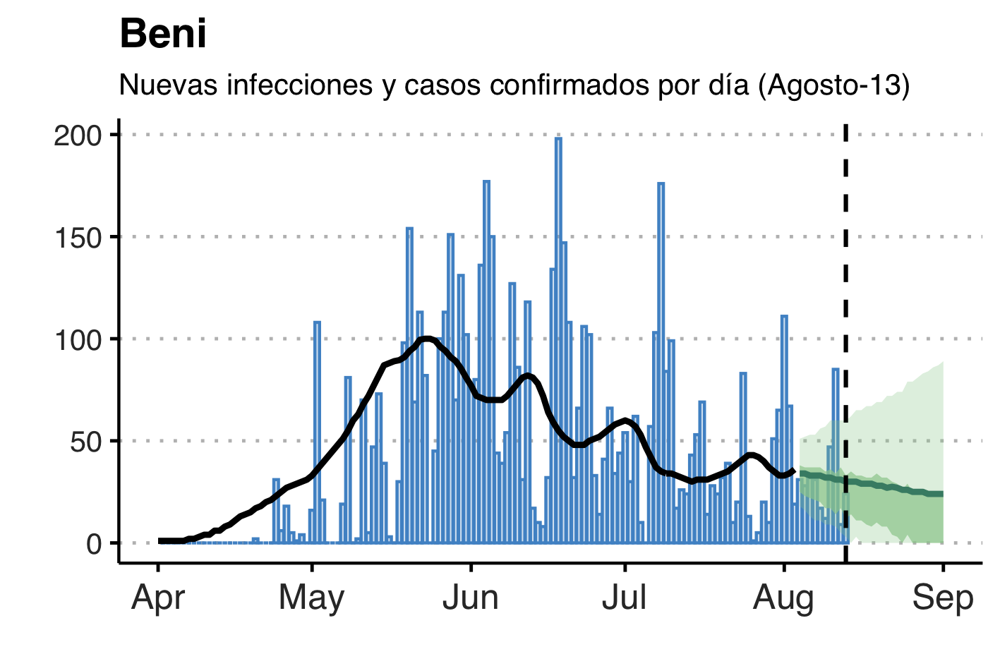
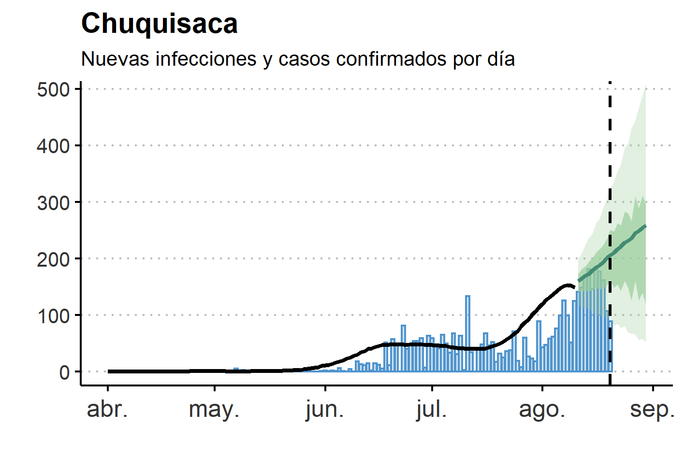
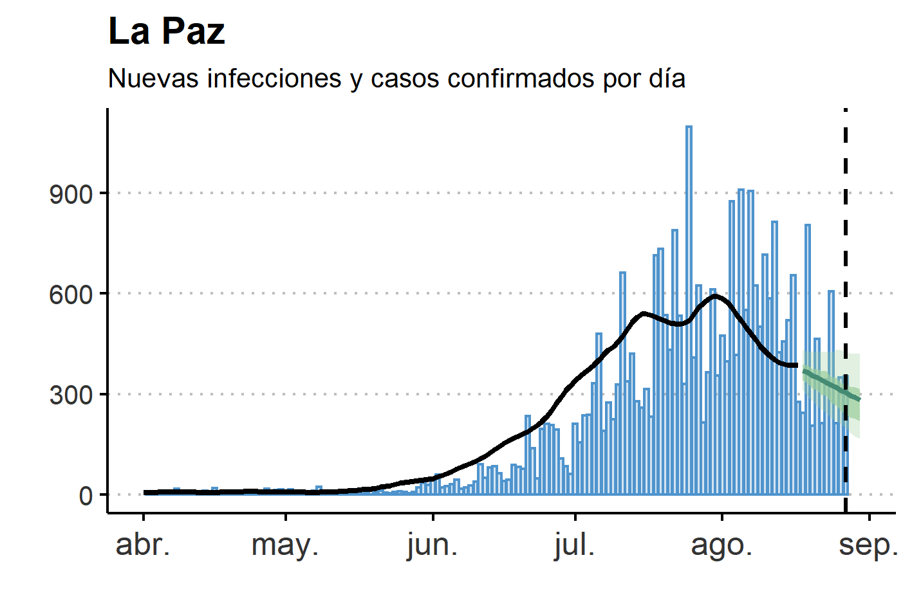
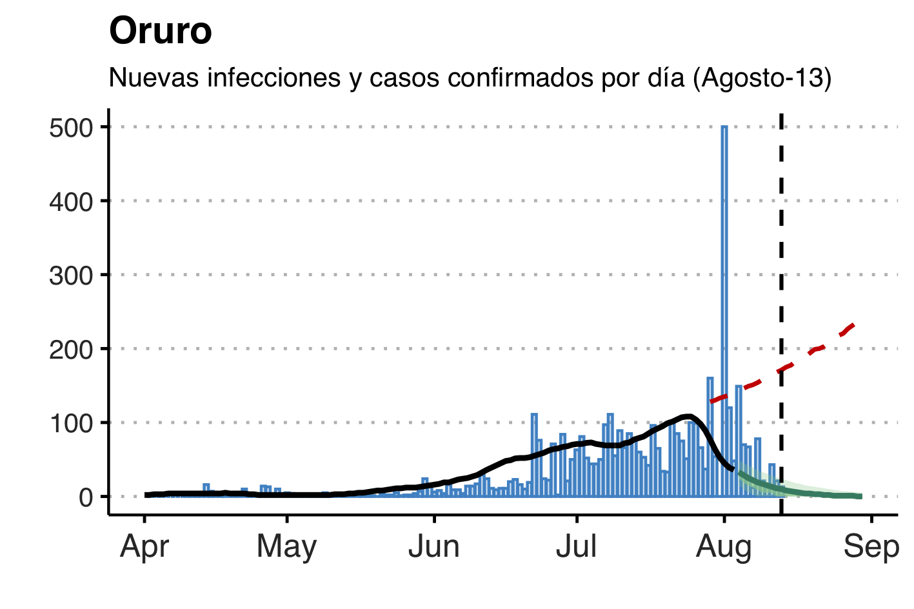
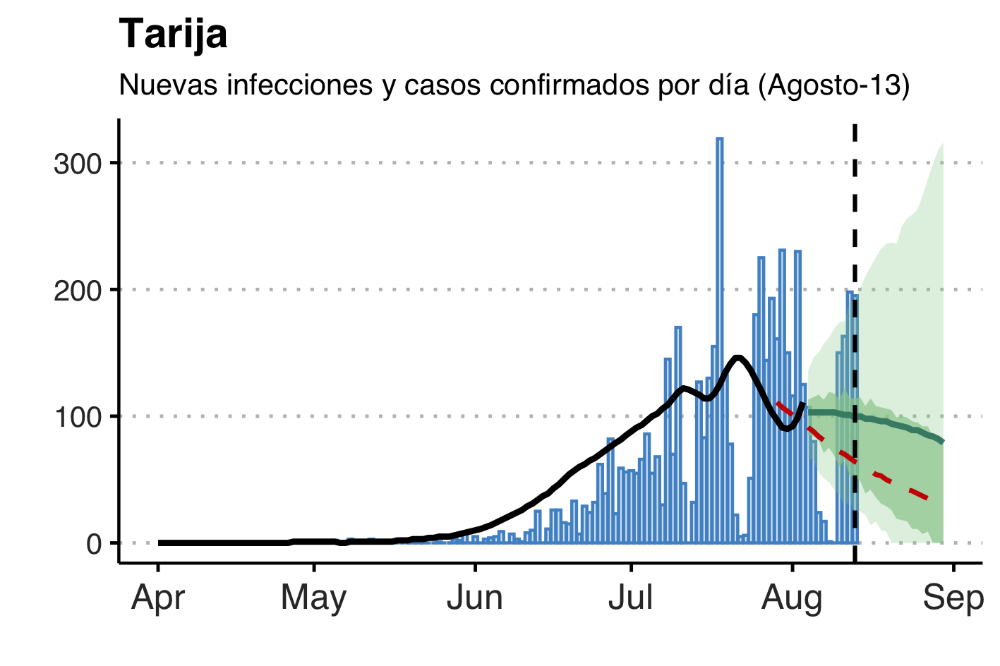

## Bienvenido

Este repositorio provee actualizaciones de los resultados del documento de trabajo: "Monitoreo en Tiempo Real del COVID-19 en Bolivia" que utiliza tres herramientas de monitoreo en tiempo real dela  pandemia  del  COVID-19con  datos  públicos  disponibles  en  Bolivia.

Los resultados se actualizan semanalmente los días sábados con la información disponible hasta el dia anterior.

### Pronóstico de nuevos casos diarios por departamento

Departamento| Mediana | Low      | High
------------|---------|----------|---------
Cochabamba  | 123     | 345      |

### Pronóstico

Markdown is a lightweight and easy-to-use syntax for styling your writing. It includes conventions for

## Resultados

