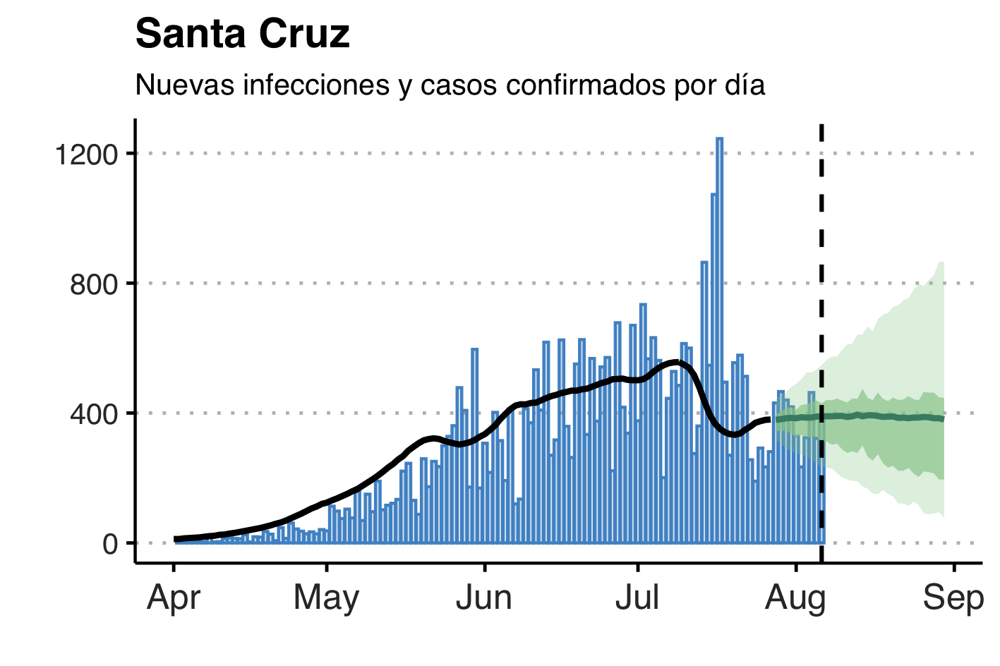

## Monitoreo COVID-19 Bolivia

Esta página web provee actualizaciones de los resultados del documento de trabajo: __Cardona, Cuba-Borda y Gonzales (2020)__, ["Monitoreo en Tiempo Real del COVID-19 en Bolivia"](doc/COV19Bolivia-Current.pdf) que utiliza tres herramientas de monitoreo en tiempo real de la  pandemia de COVID-19 con datos  públicos  disponibles  en  Bolivia.

Los resultados se actualizan semanalmente los días sábados con la información disponible hasta el dia anterior.

**Última Actualización: 26-07-2020**

**Próxima Actualización: 08-08-2020**

## Interpretación de los resultados

El cálculo de casos diarios y casos acumulados se basan en la estimación y pronóstico del número de reproducción efectivo __Rt__. Los resultados corresponden a las infecciones estimadas por día de infección. Debido al periódo de incubación y retrasos en el procesamiento de resultados de laboratorio, nuestras estimaciones se adelantan a los casos por fecha de registro oficial.

Para mayores detalles ver nuestro [documento de trabajo](doc/COV19Bolivia-Current.pdf)

## Pronósticos al 26-07-2020

En los siguientes gráficos, la linea de color verde representa la mediana de la proyección de nuevos casos diarios por fecha de infección. Las regiones con sombras claras representan el intervalo de credibilidad del 95%. Las regiones con sombrasoscuras corresponden al intervalo de credibilidad del 50%. La linea de color negro corresponde al valor estimado de infecciones por fecha de infección. Las barras azules representan el número de casos positivospor fecha oficial de confirmación. La linea vertical punteada corresponde al **26/07/2020**, la última observación de la muestra. El eje vertical se ajusta a cada departamento.

 

### Pronóstico de Casos, Totales Acumulados hasta 01-09-2020

Los resultados corresponden al total de casos por segun la fecha de infección y proveen información adelantada con respecto a los casos por fecha de diagnóstico.

**Departamento**| **Mediana** | **Infererior**| **Superior**
------------|---------|----------|---------
Beni | 6.389 | 5.435 | 9.428
Chuquisaca | 3.130 | 2.042 | 5.380
Cochabamba | 15.970 | 10.877 | 21.480
La Paz | 116.669 | 61.405 | 180.894
Oruro | 7.062 | 3.517 | 13.363
Potosi | 5.755 | 1700 | 16.538
Santa Cruz | 37.095 | 33.132 | 41.520
Tarija | 5.732 | 3.621 | 9.467
Pando |  |  | 
**Bolivia** | 197.802 | 121.729 | 298.070
**Bolivia Ajustado** | 1.186.812 | 730.374 | 1.788.420

El ajuste de casos confirmados asume que existen por lo menos 6 casos no diagnosticados por cada caso confirmado. Este supuesto es solo referencial y está basado en la estimación de seroprevalencia del estudio de __Havers, et.al. “Seroprevalence  of  Antibodies  to  SARS-CoV-2 in 10 Sites  in  the  United  States, March23-May12,2020.” JAMA Internal Medicine__.
