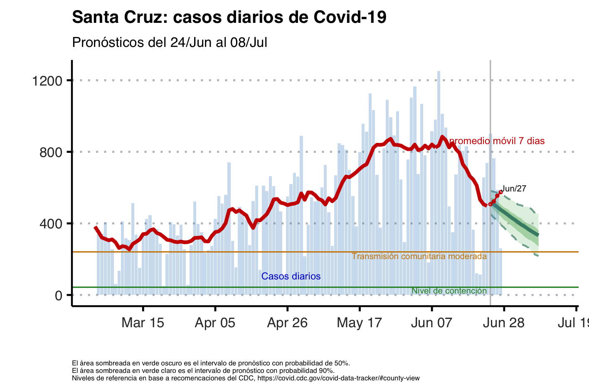
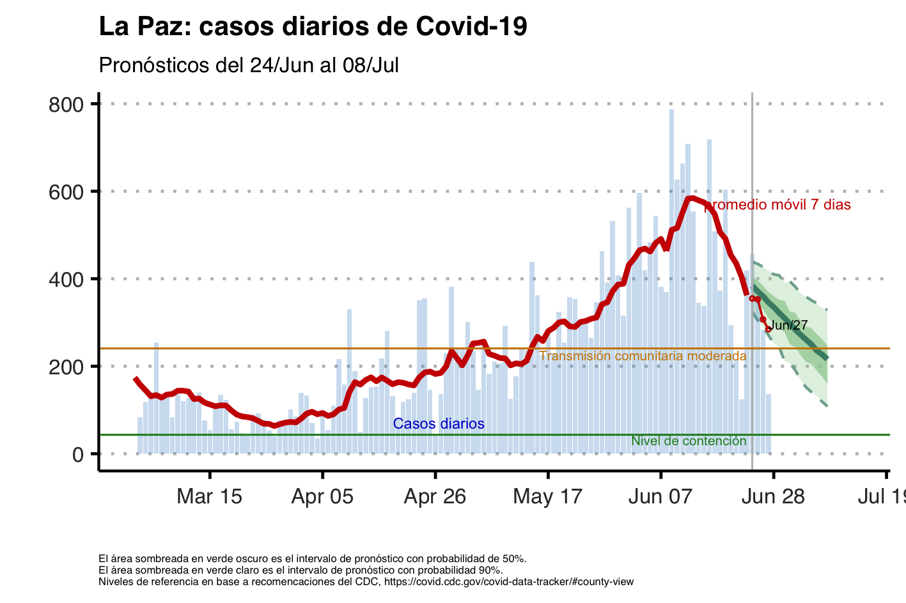
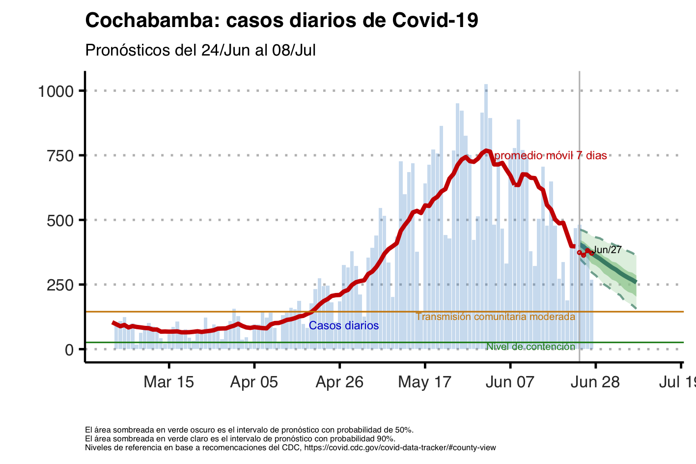
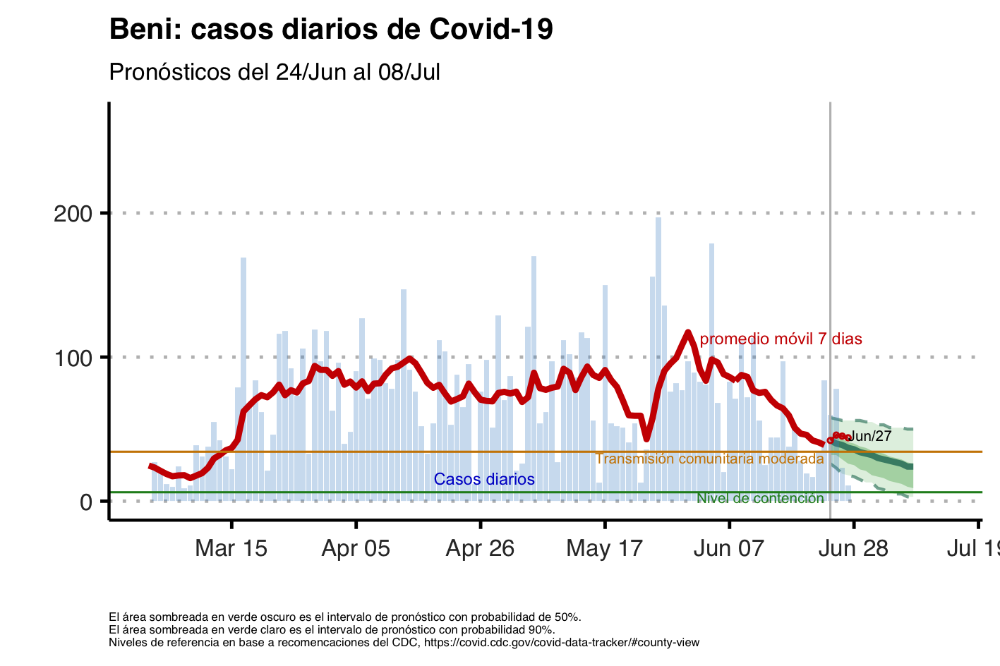
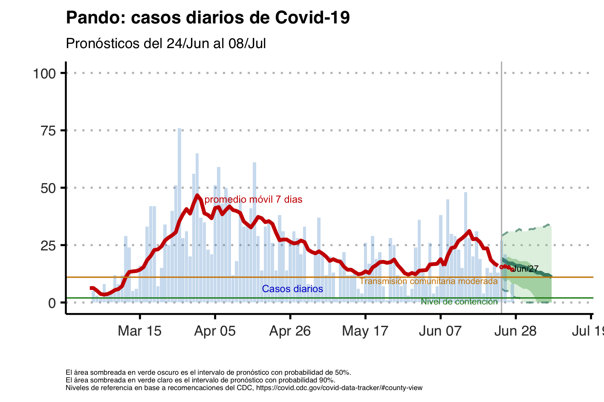
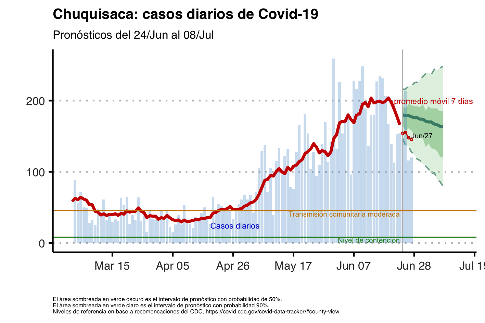
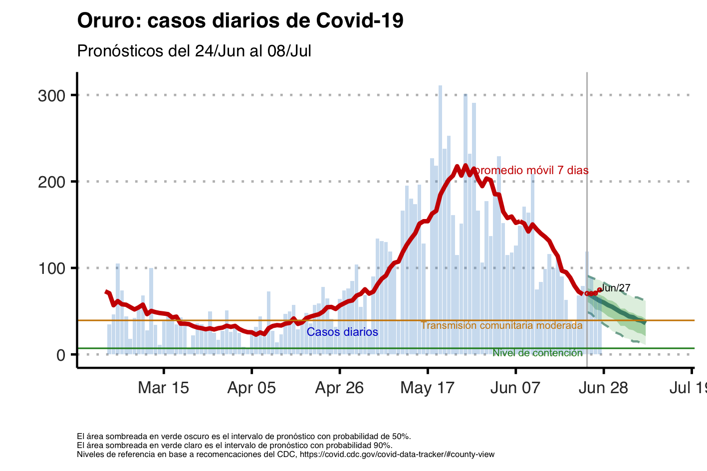
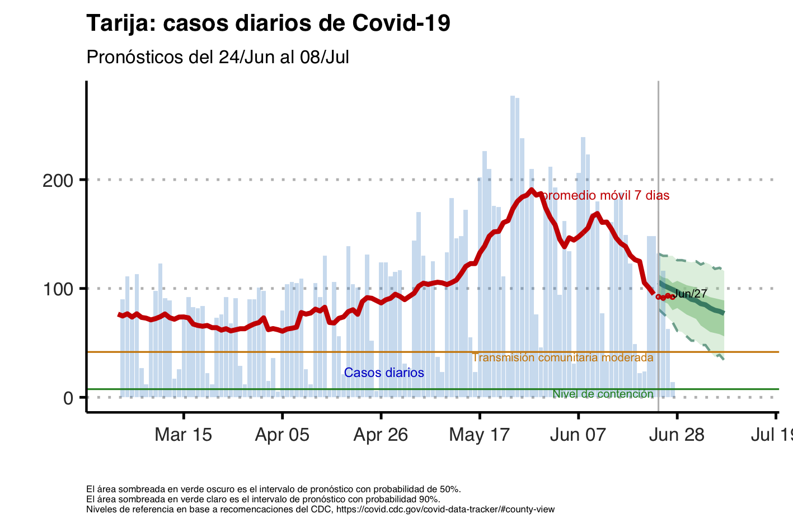

## Monitoreo COVID-19 Bolivia

Esta página web provee actualizaciones semanales de proyecciones de casos de COVID-19 en los departamentos de Bolivia

**Última Actualización: Mayo-7-2021**

## Pronósticos de Casos Diarios

* En los siguientes gráficos, las lineas punteadas representan la incertidumbre de estimación.

* Las barras transparentes corresponden al número de casos positivos según fecha oficial de confirmación y la linea de color rojo es el promedio movil de 7 días de los datos observados.

* La linea de color verde representa la mediana de la proyección de nuevos casos diarios. Las regiones con sombras claras representan el intervalo de credibilidad del 90%. Las regiones con sombras oscuras corresponden al intervalo de credibilidad del 50%.  

* La linea vertical corresponde a la fecha de estimación y los valores observados fuera de muestra son los círculos en color rojo los cuales se actualizan diariamente.

* El eje vertical se ajusta a cada departamento y está truncado para facilitar la visualización.

<!-- * Debido a la volatilidad de los datos, para Pando actualizamos los pronósticos solo cuando el número de casos acumulados durante la semana previa es superior a 50 casos. -->

## Metodología e Interpretación de los resultados
La metodología proviene del documento de trabajo: __Cardona, Cuba-Borda y Gonzales (2020)__, ["Monitoreo en Tiempo Real del COVID-19 en Bolivia"](doc/COV19Bolivia-Current.pdf) que utiliza tres herramientas de monitoreo en tiempo real de la  pandemia de COVID-19 con datos  públicos  disponibles  en  Bolivia.

El cálculo de casos diarios y casos acumulados se basan en la estimación y pronóstico del número de reproducción efectivo __Rt__. Los resultados corresponden a las infecciones estimadas por día de infección. Debido al período de incubación y retrasos en el procesamiento de resultados de laboratorio, nuestras estimaciones se adelantan a los casos por fecha de registro oficial.

Para poder hacer comparaciones con los datos observados, realizamos dos transformaciones:
* Asumimos un tiempo promedio entre infeccion y reporte de 10 dias.
* Comparamos nuestros resultados con el promedio movil semanal de casos observados para suavizar la volatilidad de los datos.

El modelo de pronóstico esta basado en el programa __EpiNow__: Abbott S, Hellewell J, Thompson RN et al. Estimating the time-varying reproduction number of SARS-CoV-2 using national and subnational case counts. Wellcome Open Res 2020, 5:112 [https://doi.org/10.12688/wellcomeopenres.16006.1](https://doi.org/10.12688/wellcomeopenres.16006.1).

Para mayores detalles ver nuestro [documento de trabajo](doc/COV19Bolivia-Current.pdf)

<!---
<iframe id="inlineFrameExample"
    title="Inline Frame Example"
    width="900"
    height="600"
    src="https://cov19bolivia.github.io/tarija.html?bbox=-0.004017949104309083%2C51.47612752641776%2C0.00030577182769775396%2C51.478569861898606&layer=mapnik">
</iframe>

### Pronóstico de Casos, Totales Acumulados hasta 01-09-2020

Los resultados corresponden al total de casos según la fecha de infección y proveen información adelantada con respecto a los casos por fecha de diagnóstico.

**Departamento**| **Proyección Central** | **Banda Inferior**| **Banda Superior**
------------|---------|----------|---------
Beni | 7,549 | 6,755 | 8,453
Chuquisaca | 5,704 | 5,260 | 6,198
Cochabamba | 12,668 | 12,048 | 13,475
La Paz | 33,385 | 31,923 | 34,973
Oruro | 5,715 | 4,961 | 6,601
Potosi | 6,041 | 5,514 | 6,725
Santa Cruz | 40,629 | 39,533 | 42,044
Tarija | 8,795 | 7,969 | 9,666
Pando | 2,566 | 2,346 | 2,845
**Bolivia: Total Casos Confirmados** | 123,052 | 116,309 | 130,980
**Bolivia: Total Infecciones (estimado)** | 738,312 | 697,854 | 785,880

El ajuste de casos confirmados para obtener el total de infecciones, asume que existen por lo menos 6 casos no diagnosticados por cada caso confirmado. Este supuesto es solo referencial y está basado en la estimación de seroprevalencia del estudio de __Havers, et.al. “Seroprevalence  of  Antibodies  to  SARS-CoV-2 in 10 Sites  in  the  United  States, March23-May12,2020.” JAMA Internal Medicine__.

## Evolución de los Pronósticos

A continuación mostramos la evolución del pronóstico de casos acumulados por departamento para diferentes momentos de estimación del modelo. Todos los pronósticos se refieren al total de infecciones esperadas hasta el **01-09-2020**

**Departamento**| **Agosto-6** | **Agosto-13**| **Agosto-20**| **Agosto-27**
------------|---------|----------|---------|---------
Beni | 11,575 | 6,525 | 6,787 | 7,549
Chuquisaca | 10,077 | 14,868 | 9,064 | 5,704
Cochabamba | 21,665 | 11,001 | 12,188 | 12,668
La Paz | 47,827 | 45,873 | 34,879 | 33,385
Oruro | 14,337 | 4,109 | 5,322 | 5,715
Potosi | 4,635 | 32,358 | 21,071 | 6,041
Santa Cruz | 48,607 | 39,471 | 39,193 | 40,629
Tarija | 8,868 | 7,301 | 12,675 | 8,795
Pando |  | 6,366 | 3,531 | 2,566
**Bolivia** | 167,591 | 167,872 | 144,710 | 123,052

(*) No contamos con pronósticos para Pando antes del 13 de Agosto debido a que el número de casos acumulados durante la semana previa a cada actualización fue menor a 200.

--->
